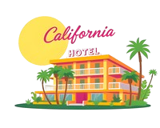

# Hotel-California

### Hotel-California — це веб-застосунок для управління готелями, який дозволяє адміністраторам ефективно керувати номерами та бронюваннями, а користувачам — зручно бронювати номери онлайн.

# 🔍 Огляд
Цей проєкт створено для автоматизації процесів бронювання та управління готелем. Він забезпечує інтерфейс для адміністраторів та гостей, дозволяючи кожному з них виконувати відповідні дії.

# 🎯 Мета
Розробити систему, яка дозволяє:

Адміністраторам:

  Додавати нові номери.

  Встановлювати ціни, статуси та інші параметри номерів.

  Переглядати та управляти списком бронювань.

Гостям:

  Переглядати список доступних номерів.

  Бронювати номер на бажану дату.

# 👥 Користувачі та їх ролі
Адміністратор:

  Керує номерами та бронюваннями.

  Має доступ до всіх функцій системи.

Гість:

  Може переглядати доступні номери.

  Створювати бронювання.

# 🗂️ Основні сутності
Номер:

  Тип (одномісний, двомісний, люкс).

  Кількість місць.

  Ціна.

  Статус (вільний, заброньований).

Користувач:

  Ім'я.

  Email.

  Роль (адміністратор, гість).

  Історія бронювань.

Бронювання:

  Номер (посилання на номер).

  Користувач (посилання на користувача).

  Дати бронювання.

  Статус (активне, скасоване).

Готель:

  Назва.

  Адреса.

  Рейтинг.

# 🚀 Функціональні можливості:

Фільтрація номерів за типом, ціною та статусом.

Бронювання номерів на вибрані дати.

Скасування бронювання.

Перегляд історії бронювань.

Адміністрування номерів та бронювань.

# 🛠️ Технології:

WinForms

C#

Sql

